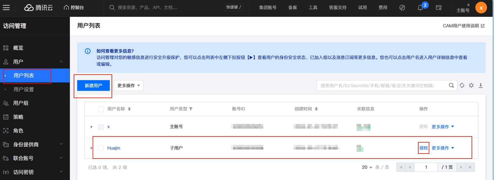
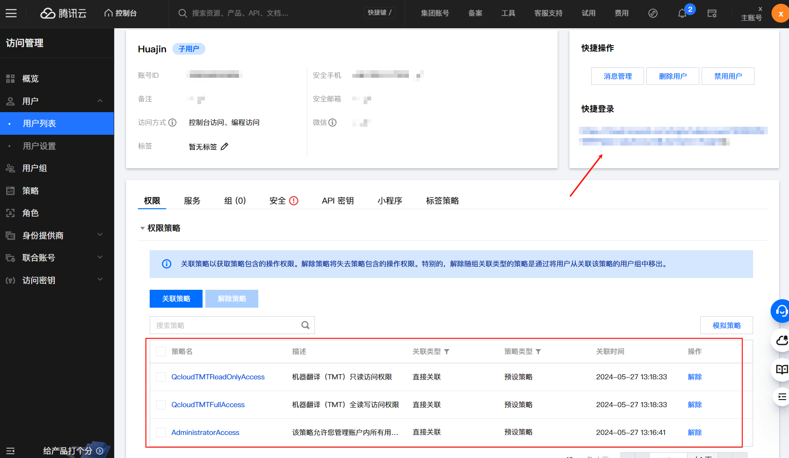
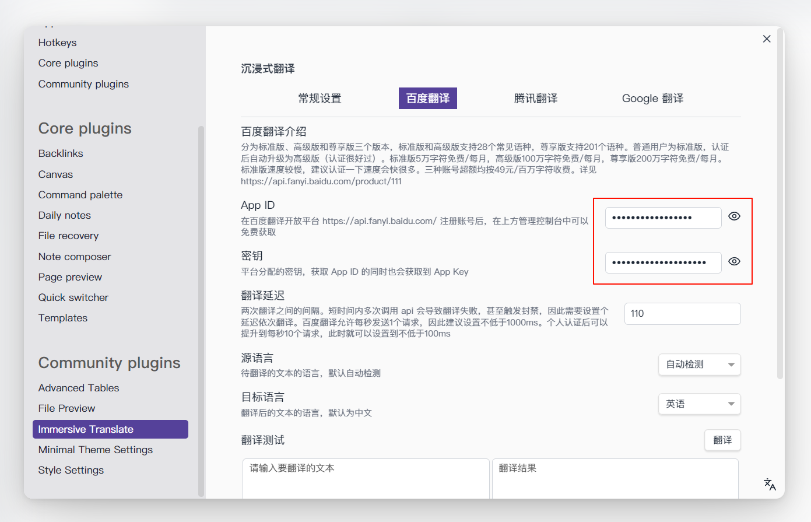
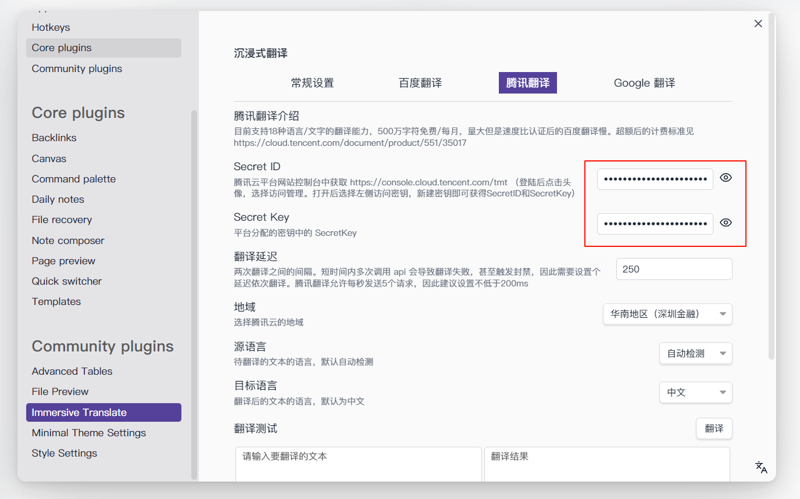
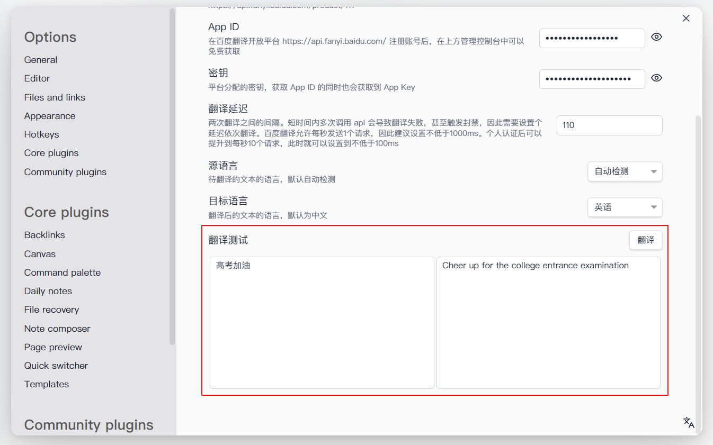

# Overview

Obsidian 版沉浸式翻译，在文本下方添加翻译内容的思路取自沉浸式翻译 (https://immersivetranslate.com/)

目前只支持使用百度翻译和腾讯翻译

可以注册获得两个翻译服务的 api 后同时使用，一个用完了换另一个，主打的就是免费量大管饱。为什么我选择写了这两个翻译服务呢，主要是因为它们免费且国内可用。如果对你有帮助的话，能给这个项目点个 star 就再好不过了。

## 一、获取密钥

### 百度翻译

先说结论：免费，100万免费字符/月够用，注册简单，速度没问题（10次请求/秒）。

百度翻译有三种类型的账号：

- 标准版：5万免费字符/月，每秒允许 1 次翻译请求，量少且非常慢，建议认证高级版；
- 高级版：标准版认证一下就可以升级为高级版，认证需要需填写真实姓名及身份证号。100万免费字符/月，每秒允许 10 次翻译请求；
- 尊享版：200万免费字符/月，需要企业认证才能获得；

详细信息见 https://fanyiapp.cdn.bcebos.com/api/doc/%E7%99%BE%E5%BA%A6%E7%BF%BB%E8%AF%91%E5%BC%80%E6%94%BE%E5%B9%B3%E5%8F%B0%E9%80%9A%E7%94%A8%E7%BF%BB%E8%AF%91API%E6%9C%8D%E5%8A%A1%E5%8D%87%E7%BA%A7%E8%AF%B4%E6%98%8E.docx

三种账号超额均按49元/百万字符收费。

如何获取百度翻译密钥：打开 https://api.fanyi.baidu.com/api/trans/product/index，选择「通用翻译 API」，点击立即使用（需要登陆），之后按照里面的提示一步步走就行（其实是我注册过了不记得后面的流程了）

### 腾讯翻译

先说结论：免费，500万免费字符/月，注册稍微复杂些，限速比百度翻译高级版限的多一倍（5次请求/秒），可以用作后备能源。

腾讯翻译密钥获取比较麻烦，但是量大管饱：

1. 打开 https://cloud.tencent.com/，注册一个腾讯云账号（有账号的直接登录就行）
2. 点击右上角头像进入「账号中心」，点击「访问管理」
3. 在「用户 => 用户列表」中创建一个子账号，同时点击授权，使得子账号具有使用机器翻译的权限

4. 点击新创建的子用户，右侧有个快捷登录，复制该链接，然后退出主账户后再打开刚刚复制的链接，否则会提示已登录

5. 登录上子账户后，点击右上角头像进入「账号中心」，点击「访问管理 => 访问密钥 => API密钥管理」新建一个密钥即可获得我们需要的 SecretID 和 SecretKey 了，注意需要自行保管，忘了就要重新生成一次。

## 二、使用

下载好插件后，打开设置面板，填入前面申请的 id 和 key 即可使用

你可以在下方的翻译框中测试是否成功

需要注意的是，两个翻译服务都需要填写一个翻译延迟，否则就会因为翻译请求发送的太快，服务器拒绝请求。百度翻译如果认证了高级版，可以延迟可以填写到 100ms 左右，略高点也为题不大，体验没啥区别。腾讯翻译每秒只允许 5 次请求，延迟需要填高一点，实测可能填到两三百以上才能确保请求不会被拒绝。

另外，百度翻译翻译文本发送采用 MD5 加密，加密速度快，但是不那么安全，用于翻译插件设置还是没什么问题的。腾讯翻译采用 SHA-256 加密，安全性能够得到保证。（ps.但是写腾讯翻译签名方法比百度翻译的折磨多了）

## 三、翻译失败

我增加了一个重新翻译的按钮，可以尝试下重新翻译。你也可以 ctrl shift i 打开控制台看看错误代码是多少，下面是两个翻译服务的部分错误代码对应翻译失败的原因：

百度翻译：54003 代表请求过多，需要增大翻译延迟。52001 代表请求超时，可能是网络卡顿，也可能是文本过长。54001表示签名错误。58003被封了（同一 IP 当日使用多个 APPID 发送翻译请求，则该IP将被封禁当日请求权限，次日解封），详见 https://api.fanyi.baidu.com/product/113

腾讯翻译：LimitExceeded.LimitedAccessFrequency 请求过快，增大翻译延迟。FailedOperation.LanguageRecognitionErr	暂时无法识别该语种，可能是因为有emoji。FailedOperation.NoFreeAmount	本月免费额度已用完。FailedOperation.ServiceIsolate	账号因为欠费停止服务，需要在腾讯云账户充值。更多请见：https://cloud.tencent.com/document/product/551/15619#6.-.E9.94.99.E8.AF.AF.E7.A0.81

